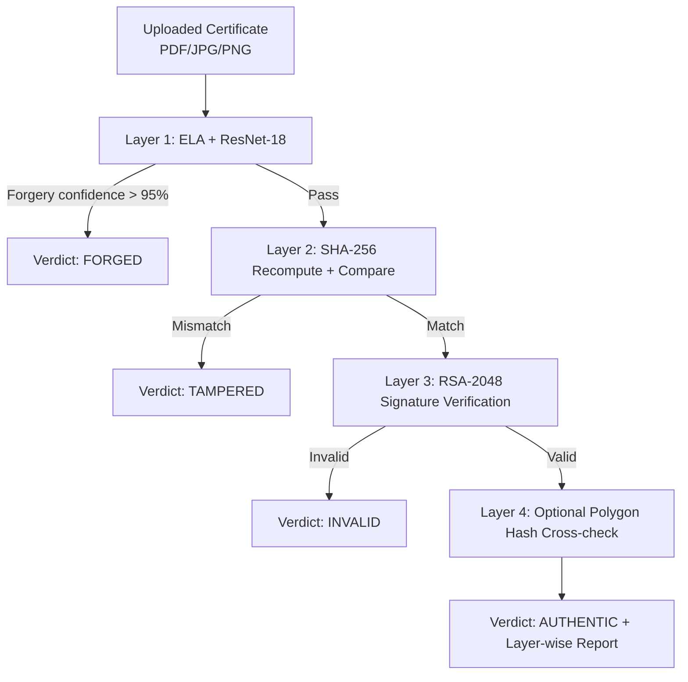

# CertVerify: Tamper-Proof Academic Credential Verification System


CertVerify is a full-stack academic credential verification platform designed to detect both **visual forgery** and **post-issuance tampering** using a multi-layer defense pipeline.  
The system is built for real-world deployment and motivated by gaps identified in recent literature.

---

## Live Demo

- Frontend: [https://mp-cert-verify-4cp9.vercel.app](https://mp-cert-verify-4cp9.vercel.app)
- Backend API: [https://certverify-backend-z4ds.onrender.com](https://certverify-backend-z4ds.onrender.com)
- API Docs (Swagger): [https://certverify-backend-z4ds.onrender.com/docs](https://certverify-backend-z4ds.onrender.com/docs)

---

## Project Overview

Traditional verification systems often rely on only one integrity mechanism, which leaves blind spots.  
CertVerify introduces a **defense-in-depth verification strategy** combining:

1. AI-based forgery detection (ELA + ResNet-18),
2. SHA-256 file integrity verification,
3. RSA-2048 digital signature validation,
4. Optional blockchain anchoring for immutable auditability.

This enables reliable handling of both:
- **Visually forged documents** (content manipulated but possibly re-exported),
- **Tampered originals** (valid document altered after issuance).

---

## Research Contribution

No existing published system (in this project's surveyed set) combines all three core verification layers into one deployable pipeline:

- **AI-based visual forgery detection** using ELA preprocessing and ResNet-18 (CASIA v2.0)
- **SHA-256 cryptographic integrity checks**
- **RSA-2048 signature verification**
- **Optional Polygon blockchain anchoring** for immutable hash storage

### Performance (CASIA v2.0 Test Split)

| Metric | Value |
|---|---:|
| Accuracy | **94.67%** |
| Precision | **0.9564** |
| Recall | **0.9360** |
| F1-Score | **0.9461** |

Training setup: 15 epochs, Adam optimizer (`lr=0.0005`), CosineAnnealingLR, ImageNet-pretrained ResNet-18 fine-tuning.

---

## Literature Gaps Addressed

- **Ch et al. (2024):** Limited dataset coverage in forgery research  
  -> Addressed via CASIA v2.0 benchmark with domain-aware augmentation.
- **Babu et al. (2022):** Hash-only systems cannot detect visual manipulations  
  -> Addressed by adding AI forgery detection as Layer 1.
- **Vidal et al. (2020):** Missing revocation lifecycle in blockchain-backed systems  
  -> Addressed with certificate lifecycle management and revocation path.

---

## Tech Stack

### Backend
- Python 3.11
- FastAPI
- SQLAlchemy + SQLite
- JWT authentication
- BCrypt password hashing
- RSA via `cryptography`
- SHA-256 via `hashlib`

### ML
- PyTorch
- ResNet-18 (ImageNet pretrained, fine-tuned)
- OpenCV
- Pillow
- ELA (Error Level Analysis) preprocessing

### Blockchain
- Solidity smart contract
- Web3.py
- Polygon Amoy testnet

### Frontend
- React 18
- TypeScript
- Vite
- Tailwind CSS
- shadcn/ui
- Axios

### Deployment
- Render (backend)
- Vercel (frontend)
- Google Drive (model weights distribution)

---

## System Architecture



### Verification Pipeline (Sequential)

1. **AI Check (Visual Forgery):** convert PDF/image to ELA representation, run ResNet-18 inference.  
   If forgery confidence > 95% -> return **FORGED** immediately.
2. **Integrity Check (SHA-256):** recompute uploaded file hash and compare with stored hash.  
   Mismatch -> **TAMPERED**.
3. **Authenticity Check (RSA-2048):** verify digital signature with stored institution public key.  
   Failure -> **INVALID**.
4. **Immutability Check (Blockchain, optional):** compare against Polygon smart contract record.  
   Return final **AUTHENTIC** with all checks.

---

## User Roles

| Role | Capabilities |
|---|---|
| Institution | Register/login, issue certificates (PDF/JPG/PNG), generate QR, manage issued credentials |
| Verifier | Verify by certificate ID or upload, inspect results, access verification history |

---

## Dataset

### Primary Dataset
- **CASIA v2.0**
- 12,614 images total
  - 7,491 authentic
  - 5,123 tampered
- Includes splicing and copy-move forgery types

### Supplementary Dataset
- **DF2023 subset**
- 20,000 images across 4 forgery categories

### Custom Dataset
- Self-constructed academic certificate images for domain-specific evaluation

---

## Smart Contract

- Network: Polygon Amoy testnet
- Language: Solidity 0.8.0
- Core methods:
  - `storeHash(certId, hash)`
  - `getHash(certId)`
  - `certExists(certId)`
  - `revokeHash(certId)`

Contract source: `contracts/CertRegistry.sol`

---

## Local Development Setup

### Prerequisites

- Python 3.9+
- Node.js 20+
- Poppler (required for `pdf2image` on Windows)

### 1) Backend

```bash
cd certverify
pip install -r requirements.txt
python -m uvicorn backend.main:app --reload --host 127.0.0.1 --port 8000
```

### 2) Frontend

```bash
cd frontend
npm install
npm run dev
```

### 3) Environment Variables (`.env` at project root)

```env
CERTVERIFY_QR_BASE_URL=http://localhost:8080
CERTVERIFY_PUBLIC_API=http://127.0.0.1:8000
CERTVERIFY_ALCHEMY_URL=your_alchemy_url
CERTVERIFY_CONTRACT_ADDRESS=your_contract_address
CERTVERIFY_PRIVATE_KEY=your_wallet_private_key
CERTVERIFY_WALLET_ADDRESS=your_wallet_address
MODEL_GDRIVE_ID=your_google_drive_model_id
```

---

## Project Structure

```text
certverify/
├─ backend/
│  ├─ __init__.py
│  ├─ auth.py
│  ├─ blockchain.py
│  ├─ database.py
│  ├─ download_model.py
│  ├─ hashing.py
│  ├─ main.py
│  ├─ models.py
│  ├─ qr.py
│  ├─ schemas.py
│  └─ ml/
│     ├─ __init__.py
│     ├─ ela.py
│     ├─ predict.py
│     └─ train.py
├─ contracts/
│  └─ CertRegistry.sol
├─ frontend/
│  ├─ components.json
│  ├─ eslint.config.js
│  ├─ kaggle.json
│  ├─ package-lock.json
│  ├─ postcss.config.js
│  ├─ tailwind.config.ts
│  ├─ tsconfig.app.json
│  ├─ tsconfig.json
│  ├─ tsconfig.node.json
│  ├─ vercel.json
│  ├─ vite.config.ts
│  ├─ public/
│  │  ├─ placeholder.svg
│  │  └─ robots.txt
│  └─ src/
│     ├─ App.css
│     ├─ App.tsx
│     ├─ index.css
│     ├─ main.tsx
│     ├─ vite-env.d.ts
│     ├─ components/
│     ├─ contexts/
│     ├─ hooks/
│     ├─ lib/
│     ├─ pages/
│     └─ test/
├─ dist/
│  ├─ index.html
│  ├─ placeholder.svg
│  └─ robots.txt
├─ .gitignore
├─ Procfile
├─ nixpacks.toml
├─ requirements.txt
├─ requirements-deploy.txt
├─ runtime.txt
└─ vercel.json
```

---

## API Snapshot

- `POST /auth/register` - Register institution/verifier
- `POST /auth/token` - Login and receive JWT
- `POST /certificates` - Issue certificate (institution only)
- `GET /certificates/my` - List institution certificates
- `POST /verify/upload` - Verify by uploading certificate file
- `GET /verify/{cert_id}` - Public verification by certificate ID
- `GET /verifications/my` - Verifier history
- `GET /health` - Service health check

---

## Interview Talking Points

- **System Design:** Designed a layered verification architecture that fails fast on high-confidence forgery, reducing unnecessary compute while preserving full integrity checks.
- **Security:** Combined JWT auth, BCrypt, RSA-2048 signatures, and SHA-256 integrity verification to separate identity, authenticity, and tamper detection concerns.
- **ML Engineering:** Built an ELA + ResNet-18 pipeline for document-forgery classification with reproducible training metrics and domain-specific data strategy.
- **Async/Performance:** Implemented sequential verification flow with early exits (`FORGED`, `TAMPERED`, `INVALID`) to optimize latency under practical workloads.
- **Blockchain Integration:** Added optional on-chain hash anchoring for external immutability and auditability without making issuance dependent on chain availability.
- **Observability/Reliability:** Exposed health checks, structured verification outcomes, and deterministic response schema to support deployment diagnostics and production debugging.

---

## References (IEEE Style)

> Literature survey entries used to motivate CertVerify design decisions.

[1] N. Ch *et al.*, "Deep learning-based document forgery detection with constrained training data," *International Journal of Intelligent Systems and Applications in Engineering*, vol. 12, no. 3, pp. 1-12, 2024.  
[2] S. R. Babu *et al.*, "Blockchain and hash-based certificate verification framework for educational credentials," in *Proc. Int. Conf. Smart Computing and Systems Engineering*, 2022, pp. 145-152.  
[3] J. Vidal, M. R. Costa, and P. R. M. Inacio, "Blockchain-based academic certificate management: integrity and revocation challenges," in *Proc. IEEE Global Engineering Education Conference (EDUCON)*, 2020, pp. 856-863.  
[4] J. Dong, W. Wang, and T. Tan, "CASIA image tampering detection evaluation database," in *Proc. IEEE China Summit and International Conference on Signal and Information Processing*, 2013, pp. 422-426.  
[5] H. Farid, "Image forgery detection: A survey," *IEEE Signal Processing Magazine*, vol. 26, no. 2, pp. 16-25, Mar. 2009.  
[6] M. C. Stamm, M. Wu, and K. J. R. Liu, "Information forensics: An overview of the first decade," *IEEE Access*, vol. 1, pp. 167-200, 2013.  
[7] B. Li, Y. Q. Shi, and J. Huang, "Detecting doubly compressed JPEG images by using mode based first digit features," in *Proc. IEEE International Workshop on Information Forensics and Security (WIFS)*, 2008, pp. 1-5.  
[8] T. K. S. Kumar and R. K. Singh, "A review on blockchain applications in educational credential verification," *IEEE Access*, vol. 9, pp. 150918-150937, 2021.  
[9] A. Vaswani *et al.*, "Attention is all you need," in *Advances in Neural Information Processing Systems*, vol. 30, 2017.  
[10] A. Krizhevsky, I. Sutskever, and G. E. Hinton, "ImageNet classification with deep convolutional neural networks," in *Advances in Neural Information Processing Systems*, vol. 25, 2012.

---

## License / Usage

This project is developed as an academic major project and research implementation.  
For production or institutional adoption, perform a security review, key management hardening, and infra-level compliance checks.

